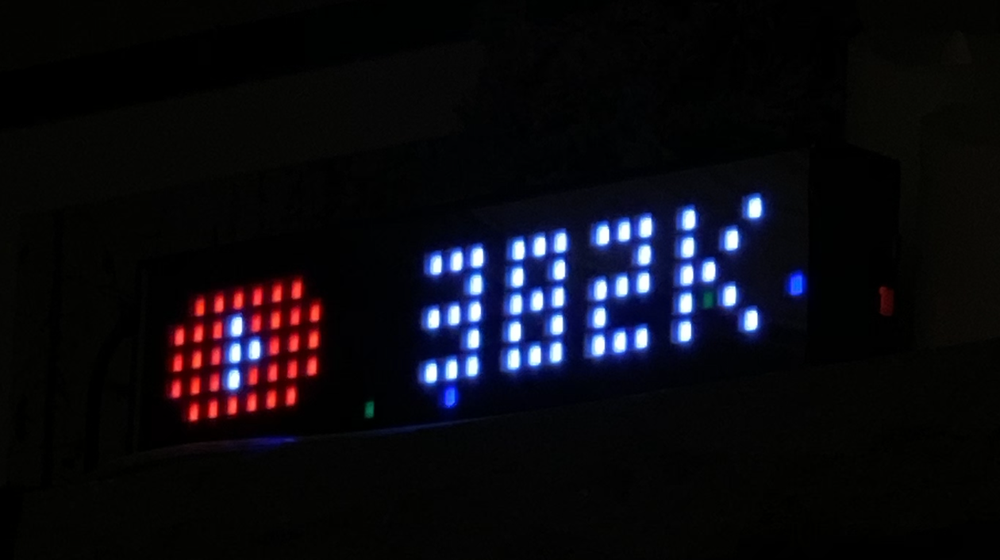
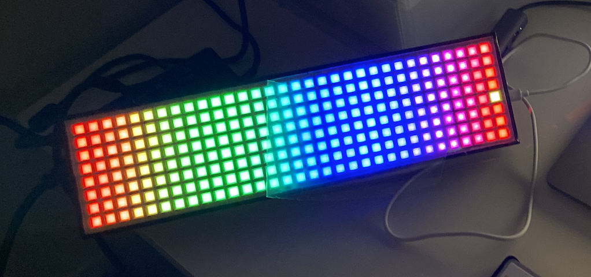
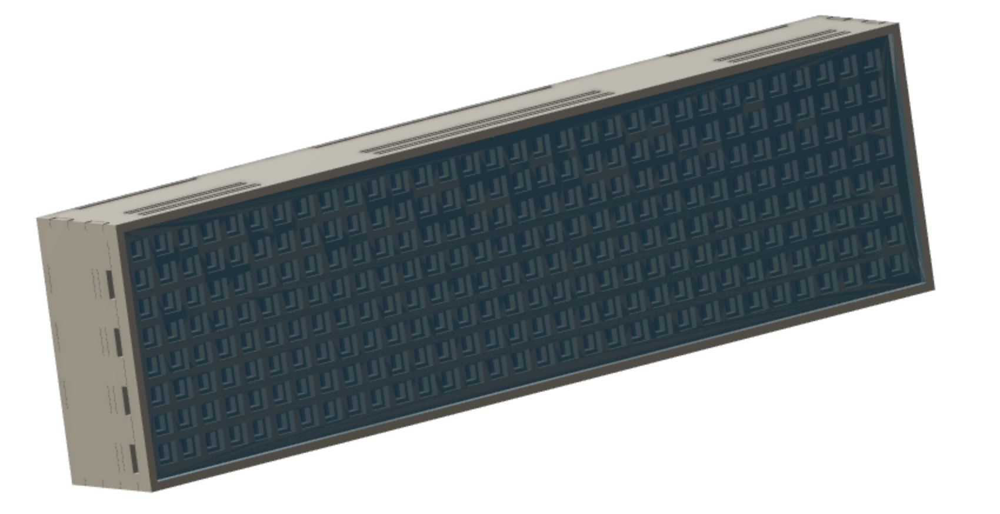
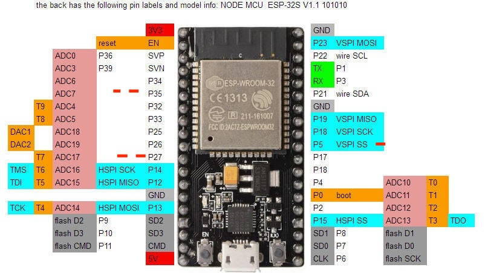

# Proj__LED-Matrix-Youtube-Subscriber-Display
A little matrix display for showing YouTube subscriber

A gift for Devon.

## Realtime sync
- Please duplicate 'proj_credential_template.h' and rename as 'proj_credential.h', and fill in your credential

## Hardware

- [ESP 32](https://github.com/playelek/pinout-doit-32devkitv1)

  

- WS2812B 5050 8x32 RGB Flexible LED Matrix Panel
- Power supply **5 V / 10 A**
- Other components:
  - 3.3V => 5V logic shifter
  - capacitors
  - resistor (to prevent 1st LED burnt out due to current spike)

